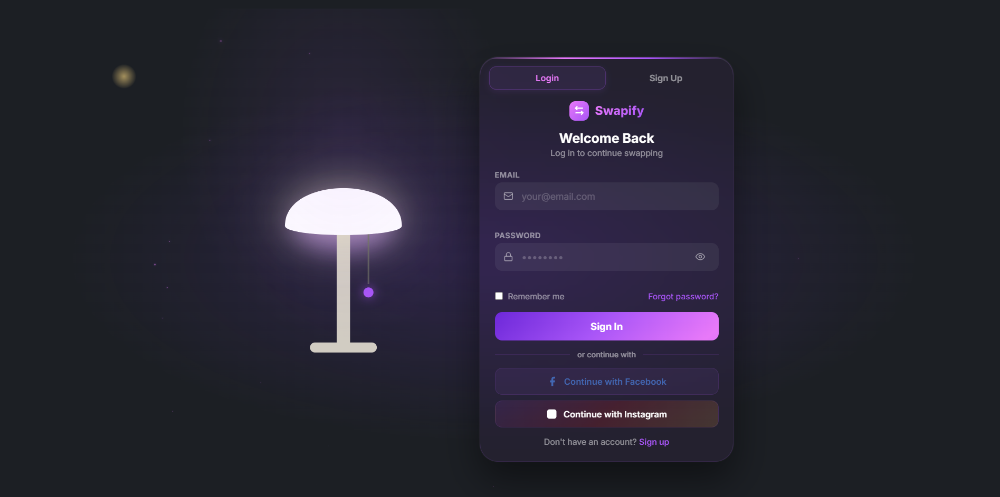
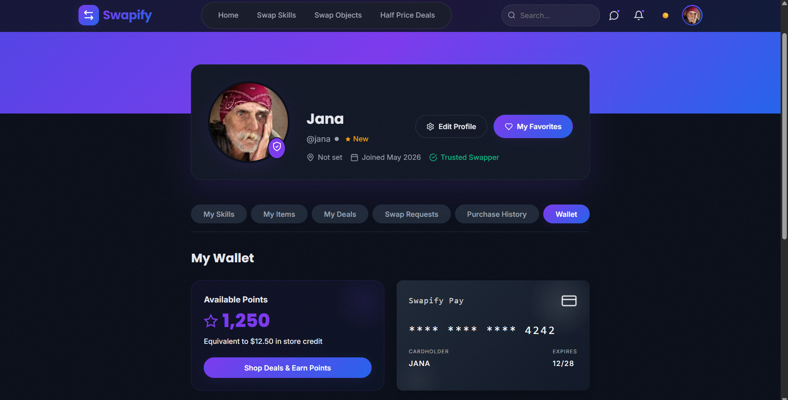
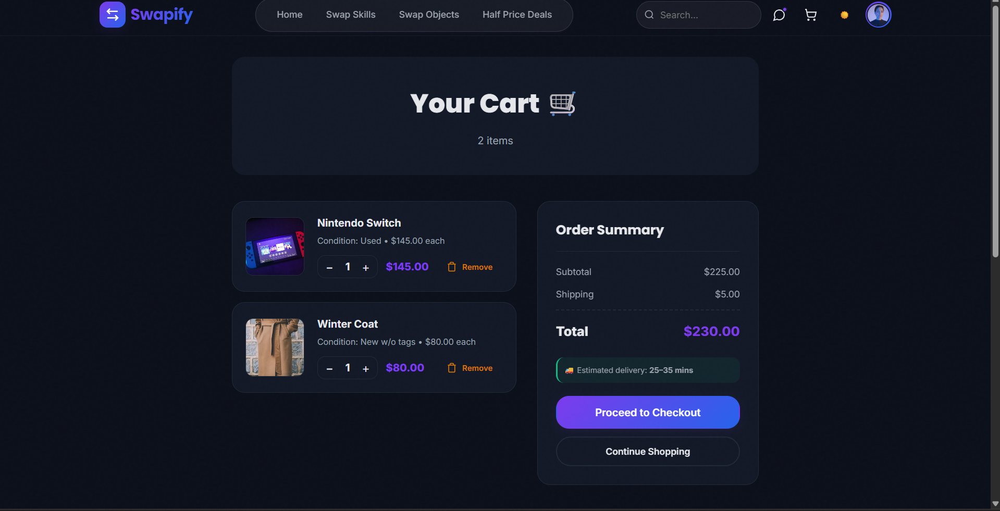
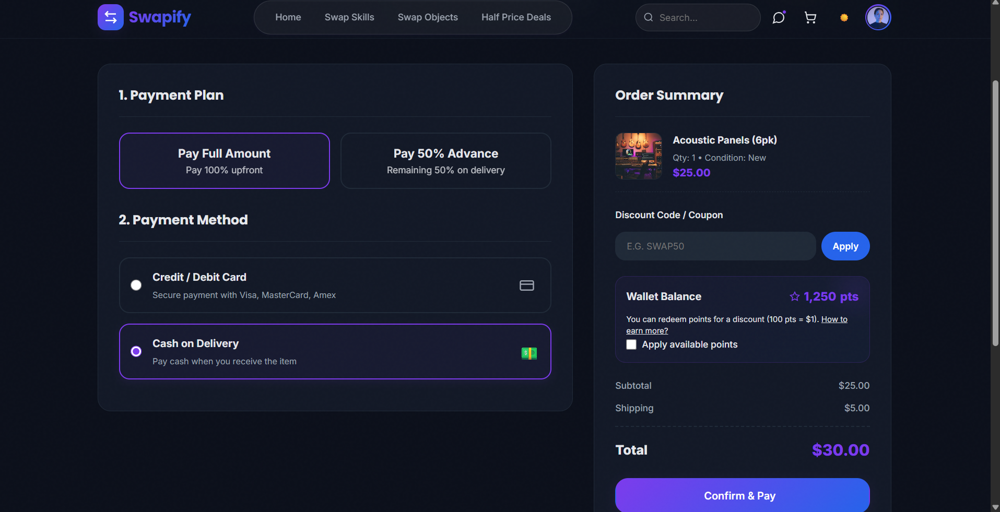
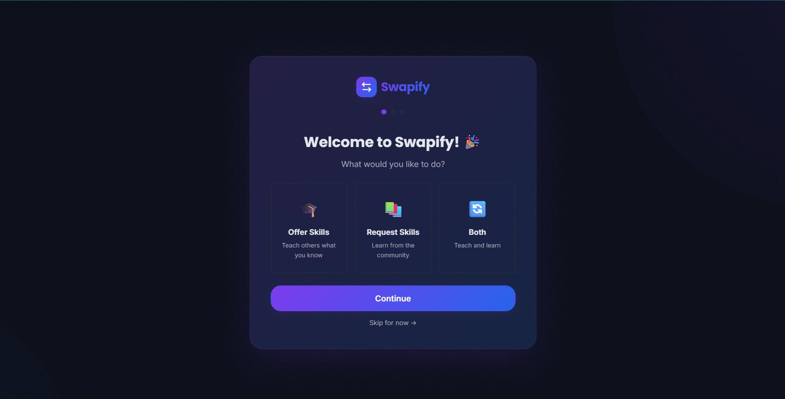
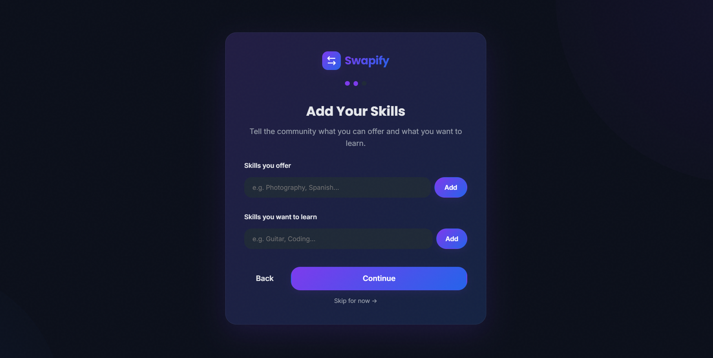
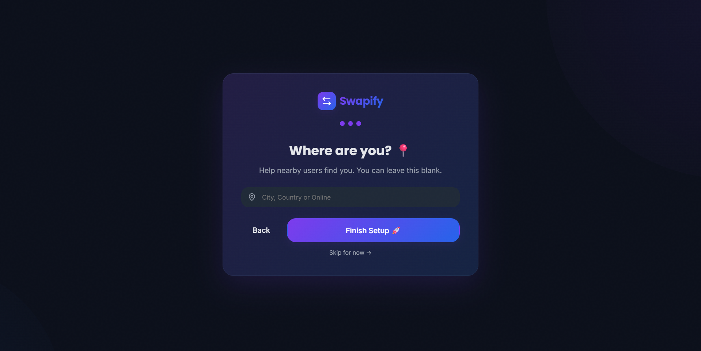
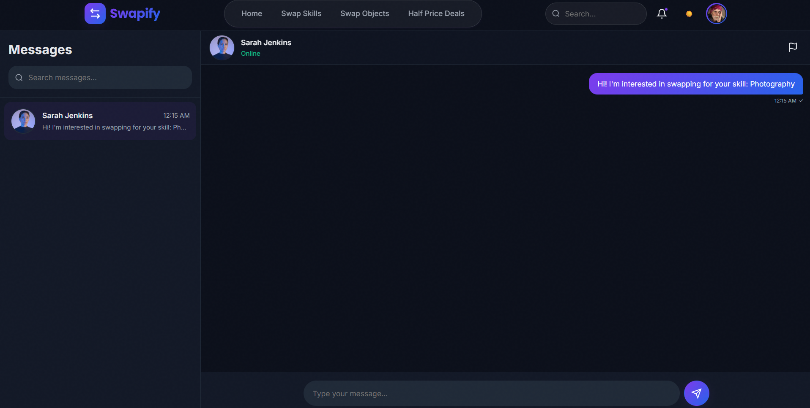

git clone https://github.com/your# 🔄 Swapify — Cozy Community Marketplace

[](https://developer.mozilla.org/en-US/docs/Web/HTML)
[](https://developer.mozilla.org/en-US/docs/Web/CSS)
[](https://developer.mozilla.org/en-US/docs/Web/JavaScript)

Swapify is a full-featured web application that enables community-driven swapping of skills, physical items, and half-price deals[cite: 1]. The platform focuses on reducing waste, building local connections, and fostering a trust-based sharing economy[cite: 1].

---

## 📸 Visual Preview

### 🖥️ Core Interfaces
Experience a cozy and intuitive community environment across all devices.

| Login Interface | Main Community Page | User Profile |
| :---: | :---: | :---: |
|  |  |  |
| *Interactive Lamp Toggle UI* | *Skill & Object Swap Feed* | *Manage Wallet & Swaps* |

---

### 🛍️ Marketplace & Shopping
A seamless flow from discovering deals to secure simulated checkout.

| Half-Price Deals | Shopping Cart | Secure Payment |
| :---: | :---: | :---: |
|  |  |  |
| *Daily Point-Redeemable Deals* | *Persistent LocalStorage Cart* | *Points & Promo Integration* |

---

### 📖 User Onboarding & Communication
<details>
<summary><b>Click to view Onboarding and Messaging Flow</b></summary>

#### Onboarding Experience
A 3-stage welcome flow to set up user preferences and community location.
<p align="center">
  
  
  
</p>

#### Real-time Messaging
Connect with swappers instantly via the built-in chat interface.
<p align="center">
  
</p>

</details>

---

## 🌟 Overview

**Swapify** allows users to:
*   Swap **skills** (teach photography, get guitar lessons, etc.)[cite: 1].
*   Swap **physical objects** (furniture, electronics, clothing)[cite: 1].
*   Buy/sell **half-price deals** with a points-based rewards system[cite: 1].
*   Earn **Swapify Points** on purchases and redeem them for discounts[cite: 1].
*   Report users and manage community safety[cite: 1].

Built with vanilla HTML/CSS/JS, the app uses `localStorage` as its data store, making it fully client-side and ready to run without a backend server[cite: 1].

---

## ✨ Features

### Core Marketplace
*   **Skill Swaps**: Offer and request skills with level ratings (Beginner → Expert)[cite: 1].
*   **Object Swaps**: Trade physical items; each listing shows "wants"[cite: 1].
*   **Half-Price Deals**: Discounted items with cart, checkout, and payment simulation[cite: 1].
*   **Search & Filters**: Live search + multi-criteria filtering (category, condition, rating, level, location)[cite: 1].
*   **Favorites**: Heart-based wishlist system[cite: 1].

### Shopping & Rewards
*   **Shopping Cart**: Persistent cart with quantity controls and stock management[cite: 1].
*   **Checkout**: Credit/debit card form, Cash on Delivery, and 50% split payment plan options[cite: 1].
*   **Swapify Points**: Earn 10 points per $1 spent; 100 points = $1 discount[cite: 1].
*   **Wallet**: View points balance, transaction history, and saved payment cards[cite: 1].

### Communication & Safety
*   **Messaging**: Real-time chat between users with message status (sent/delivered)[cite: 1].
*   **Reporting**: Comprehensive user/listing report form with file attachments (images/PDF)[cite: 1].

### Admin Dashboard
*   **User Management**: View, search, ban, suspend, activate, or delete users[cite: 1].
*   **Skill Moderation**: Approve or reject skill listings[cite: 1].
*   **Metrics**: Live stats (users, skills, swaps, open reports)[cite: 1].

---

## 🛠️ Technology Stack

| Layer | Technology |
| :--- | :--- |
| **Frontend** | HTML5, CSS3, JavaScript (ES6+)[cite: 1] |
| **Animation** | CSS keyframes + GSAP (for lamp toggle effect on login page)[cite: 1] |
| **Storage** | `localStorage` (client-side persistence)[cite: 1] |
| **Architecture** | Modular global objects (`SwapifyAuth`, `SwapifyStore`, etc.)[cite: 1] |

---

## 🚀 Getting Started

### Prerequisites
*   Any modern web browser (Chrome 90+, Firefox 88+, Safari 14+, Edge 90+)[cite: 1].
*   No server, database, or build step required[cite: 1].

### Installation
1.  **Clone the repository**:
    ```bash
    git clone [https://github.com/yourusername/swapify.git](https://github.com/yourusername/swapify.git)
    cd swapify
    ```
2.  **Open `index.html`** directly in your browser# 🔄 Swapify — Cozy Community Marketplace

[](https://developer.mozilla.org/en-US/docs/Web/HTML)
[](https://developer.mozilla.org/en-US/docs/Web/CSS)
[](https://developer.mozilla.org/en-US/docs/Web/JavaScript)

Swapify is a full-featured web application that enables community-driven swapping of skills, physical items, and half-price deals[cite: 1]. The platform focuses on reducing waste, building local connections, and fostering a trust-based sharing economy[cite: 1].

---

## 📸 Visual Preview

### 🖥️ Core Interfaces
Experience a cozy and intuitive community environment across all devices.

| Login Interface | Main Community Page | User Profile |
| :---: | :---: | :---: |
|  |  |  |
| *Interactive Lamp Toggle UI* | *Skill & Object Swap Feed* | *Manage Wallet & Swaps* |

---

### 🛍️ Marketplace & Shopping
A seamless flow from discovering deals to secure simulated checkout.

| Half-Price Deals | Shopping Cart | Secure Payment |
| :---: | :---: | :---: |
|  |  |  |
| *Daily Point-Redeemable Deals* | *Persistent LocalStorage Cart* | *Points & Promo Integration* |

---

### 📖 User Onboarding & Communication
<details>
<summary><b>Click to view Onboarding and Messaging Flow</b></summary>

#### Onboarding Experience
A 3-stage welcome flow to set up user preferences and community location.
<p align="center">
  
  
  
</p>

#### Real-time Messaging
Connect with swappers instantly via the built-in chat interface.
<p align="center">
  
</p>

</details>

---

## 🌟 Overview

**Swapify** allows users to:
*   Swap **skills** (teach photography, get guitar lessons, etc.)[cite: 1].
*   Swap **physical objects** (furniture, electronics, clothing)[cite: 1].
*   Buy/sell **half-price deals** with a points-based rewards system[cite: 1].
*   Earn **Swapify Points** on purchases and redeem them for discounts[cite: 1].
*   Report users and manage community safety[cite: 1].

Built with vanilla HTML/CSS/JS, the app uses `localStorage` as its data store, making it fully client-side and ready to run without a backend server[cite: 1].

---

## ✨ Features

### Core Marketplace
*   **Skill Swaps**: Offer and request skills with level ratings (Beginner → Expert)[cite: 1].
*   **Object Swaps**: Trade physical items; each listing shows "wants"[cite: 1].
*   **Half-Price Deals**: Discounted items with cart, checkout, and payment simulation[cite: 1].
*   **Search & Filters**: Live search + multi-criteria filtering (category, condition, rating, level, location)[cite: 1].
*   **Favorites**: Heart-based wishlist system[cite: 1].

### Shopping & Rewards
*   **Shopping Cart**: Persistent cart with quantity controls and stock management[cite: 1].
*   **Checkout**: Credit/debit card form, Cash on Delivery, and 50% split payment plan options[cite: 1].
*   **Swapify Points**: Earn 10 points per $1 spent; 100 points = $1 discount[cite: 1].
*   **Wallet**: View points balance, transaction history, and saved payment cards[cite: 1].

### Communication & Safety
*   **Messaging**: Real-time chat between users with message status (sent/delivered)[cite: 1].
*   **Reporting**: Comprehensive user/listing report form with file attachments (images/PDF)[cite: 1].

### Admin Dashboard
*   **User Management**: View, search, ban, suspend, activate, or delete users[cite: 1].
*   **Skill Moderation**: Approve or reject skill listings[cite: 1].
*   **Metrics**: Live stats (users, skills, swaps, open reports)[cite: 1].

---

## 🛠️ Technology Stack

| Layer | Technology |
| :--- | :--- |
| **Frontend** | HTML5, CSS3, JavaScript (ES6+)[cite: 1] |
| **Animation** | CSS keyframes + GSAP (for lamp toggle effect on login page)[cite: 1] |
| **Storage** | `localStorage` (client-side persistence)[cite: 1] |
| **Architecture** | Modular global objects (`SwapifyAuth`, `SwapifyStore`, etc.)[cite: 1] |

---

## 🚀 Getting Started

### Prerequisites
*   Any modern web browser (Chrome 90+, Firefox 88+, Safari 14+, Edge 90+)[cite: 1].
*   No server, database, or build step required[cite: 1].

### Installation
1.  **Clone the repository**:
    ```bash
    git clone [https://github.com/yourusername/swapify.git](https://github.com/yourusername/swapify.git)
    cd swapify
    ```
2.  **Open `index.html`** directly in your browser[cite: 1].

### Default# 🔄 Swapify — Cozy Community Marketplace

[](https://developer.mozilla.org/en-US/docs/Web/HTML)
[](https://developer.mozilla.org/en-US/docs/Web/CSS)
[](https://developer.mozilla.org/en-US/docs/Web/JavaScript)

Swapify is a full-featured web application that enables community-driven swapping of skills, physical items, and half-price deals[cite: 1]. The platform focuses on reducing waste, building local connections, and fostering a trust-based sharing economy[cite: 1].

---

## 📸 Visual Preview

### 🖥️ Core Interfaces
Experience a cozy and intuitive community environment across all devices.

| Login Interface | Main Community Page | User Profile |
| :---: | :---: | :---: |
|  |  |  |
| *Interactive Lamp Toggle UI* | *Skill & Object Swap Feed* | *Manage Wallet & Swaps* |

---

### 🛍️ Marketplace & Shopping
A seamless flow from discovering deals to secure simulated checkout.

| Half-Price Deals | Shopping Cart | Secure Payment |
| :---: | :---: | :---: |
|  |  |  |
| *Daily Point-Redeemable Deals* | *Persistent LocalStorage Cart* | *Points & Promo Integration* |

---

### 📖 User Onboarding & Communication
<details>
<summary><b>Click to view Onboarding and Messaging Flow</b></summary>

#### Onboarding Experience
A 3-stage welcome flow to set up user preferences and community location.
<p align="center">
  
  
  
</p>

#### Real-time Messaging
Connect with swappers instantly via the built-in chat interface.
<p align="center">
  
</p>

</details>

---

## 🌟 Overview

**Swapify** allows users to:
*   Swap **skills** (teach photography, get guitar lessons, etc.)[cite: 1].
*   Swap **physical objects** (furniture, electronics, clothing)[cite: 1].
*   Buy/sell **half-price deals** with a points-based rewards system[cite: 1].
*   Earn **Swapify Points** on purchases and redeem them for discounts[cite: 1].
*   Report users and manage community safety[cite: 1].

Built with vanilla HTML/CSS/JS, the app uses `localStorage` as its data store, making it fully client-side and ready to run without a backend server[cite: 1].

---

## ✨ Features

### Core Marketplace
*   **Skill Swaps**: Offer and request skills with level ratings (Beginner → Expert)[cite: 1].
*   **Object Swaps**: Trade physical items; each listing shows "wants"[cite: 1].
*   **Half-Price Deals**: Discounted items with cart, checkout, and payment simulation[cite: 1].
*   **Search & Filters**: Live search + multi-criteria filtering (category, condition, rating, level, location)[cite: 1].
*   **Favorites**: Heart-based wishlist system[cite: 1].

### Shopping & Rewards
*   **Shopping Cart**: Persistent cart with quantity controls and stock management[cite: 1].
*   **Checkout**: Credit/debit card form, Cash on Delivery, and 50% split payment plan options[cite: 1].
*   **Swapify Points**: Earn 10 points per $1 spent; 100 points = $1 discount[cite: 1].
*   **Wallet**: View points balance, transaction history, and saved payment cards[cite: 1].

### Communication & Safety
*   **Messaging**: Real-time chat between users with message status (sent/delivered)[cite: 1].
*   **Reporting**: Comprehensive user/listing report form with file attachments (images/PDF)[cite: 1].

### Admin Dashboard
*   **User Management**: View, search, ban, suspend, activate, or delete users[cite: 1].
*   **Skill Moderation**: Approve or reject skill listings[cite: 1].
*   **Metrics**: Live stats (users, skills, swaps, open reports)[cite: 1].

---

## 🛠️ Technology Stack

| Layer | Technology |
| :--- | :--- |
| **Frontend** | HTML5, CSS3, JavaScript (ES6+)[cite: 1] |
| **Animation** | CSS keyframes + GSAP (for lamp toggle effect on login page)[cite: 1] |
| **Storage** | `localStorage` (client-side persistence)[cite: 1] |
| **Architecture** | Modular global objects (`SwapifyAuth`, `SwapifyStore`, etc.)[cite: 1] |

---

## 🚀 Getting Started

### Prerequisites
*   Any modern web browser (Chrome 90+, Firefox 88+, Safari 14+, Edge 90+)[cite: 1].
*   No server, database, or build step required[cite: 1].

### Installation
1.  **Clone the repository**:
    ```bash
    git clone [https://github.com/yourusername/swapify.git](https://github.com/yourusername/swapify.git)
    cd swapify
    ```
2.  **Open `index.html`** directly in your browser[cite: 1].

### Default Test Accounts
| Role | Email | Password |
| :--- | :--- | :--- |
| **Admin** | `sarah@example.com` | `Test# 🔄 Swapify — Cozy Community Marketplace

[](https://developer.mozilla.org/en-US/docs/Web/HTML)
[](https://developer.mozilla.org/en-US/docs/Web/CSS)
[](https://developer.mozilla.org/en-US/docs/Web/JavaScript)

Swapify is a full-featured web application that enables community-driven swapping of skills, physical items, and half-price deals[cite: 1]. The platform focuses on reducing waste, building local connections, and fostering a trust-based sharing economy[cite: 1].

---

## 📸 Visual Preview

### 🖥️ Core Interfaces
Experience a cozy and intuitive community environment across all devices.

| Login Interface | Main Community Page | User Profile |
| :---: | :---: | :---: |
|  |  |  |
| *Interactive Lamp Toggle UI* | *Skill & Object Swap Feed* | *Manage Wallet & Swaps* |

---

### 🛍️ Marketplace & Shopping
A seamless flow from discovering deals to secure simulated checkout.

| Half-Price Deals | Shopping Cart | Secure Payment |
| :---: | :---: | :---: |
|  |  |  |
| *Daily Point-Redeemable Deals* | *Persistent LocalStorage Cart* | *Points & Promo Integration* |

---

### 📖 User Onboarding & Communication
<details>
<summary><b>Click to view Onboarding and Messaging Flow</b></summary>

#### Onboarding Experience
A 3-stage welcome flow to set up user preferences and community location.
<p align="center">
  
  
  
</p>

#### Real-time Messaging
Connect with swappers instantly via the built-in chat interface.
<p align="center">
  
</p>

</details>

---

## 🌟 Overview

**Swapify** allows users to:
*   Swap **skills** (teach photography, get guitar lessons, etc.)[cite: 1].
*   Swap **physical objects** (furniture, electronics, clothing)[cite: 1].
*   Buy/sell **half-price deals** with a points-based rewards system[cite: 1].
*   Earn **Swapify Points** on purchases and redeem them for discounts[cite: 1].
*   Report users and manage community safety[cite: 1].

Built with vanilla HTML/CSS/JS, the app uses `localStorage` as its data store, making it fully client-side and ready to run without a backend server[cite: 1].

---

## ✨ Features

### Core Marketplace
*   **Skill Swaps**: Offer and request skills with level ratings (Beginner → Expert)[cite: 1].
*   **Object Swaps**: Trade physical items; each listing shows "wants"[cite: 1].
*   **Half-Price Deals**: Discounted items with cart, checkout, and payment simulation[cite: 1].
*   **Search & Filters**: Live search + multi-criteria filtering (category, condition, rating, level, location)[cite: 1].
*   **Favorites**: Heart-based wishlist system[cite: 1].

### Shopping & Rewards
*   **Shopping Cart**: Persistent cart with quantity controls and stock management[cite: 1].
*   **Checkout**: Credit/debit card form, Cash on Delivery, and 50% split payment plan options[cite: 1].
*   **Swapify Points**: Earn 10 points per $1 spent; 100 points = $1 discount[cite: 1].
*   **Wallet**: View points balance, transaction history, and saved payment cards[cite: 1].

### Communication & Safety
*   **Messaging**: Real-time chat between users with message status (sent/delivered)[cite: 1].
*   **Reporting**: Comprehensive user/listing report form with file attachments (images/PDF)[cite: 1].

### Admin Dashboard
*   **User Management**: View, search, ban, suspend, activate, or delete users[cite: 1].
*   **Skill Moderation**: Approve or reject skill listings[cite: 1].
*   **Metrics**: Live stats (users, skills, swaps, open reports)[cite: 1].

---

## 🛠️ Technology Stack

| Layer | Technology |
| :--- | :--- |
| **Frontend** | HTML5, CSS3, JavaScript (ES6+)[cite: 1] |
| **Animation** | CSS keyframes + GSAP (for lamp toggle effect on login page)[cite: 1] |
| **Storage** | `localStorage` (client-side persistence)[cite: 1] |
| **Architecture** | Modular global objects (`SwapifyAuth`, `SwapifyStore`, etc.)[cite: 1] |

---

## 🚀 Getting Started

### Prerequisites
*   Any modern web browser (Chrome 90+, Firefox 88+, Safari 14+, Edge 90+)[cite: 1].
*   No server, database, or build step required[cite: 1].

### Installation
1.  **Clone the repository**:
    ```bash
    git clone [https://github.com/yourusername/swapify.git](https://github.com/yourusername/swapify.git)
    cd swapify
    ```
2.  **Open `index.html`** directly in your browser[cite: 1].

### Default Test Accounts
| Role | Email | Password |
| :--- | :--- | :--- |
| **Admin** | `sarah@example.com` | `Test@1234` |
| **User** | `carlos@example.com` | `Test@1234` |

# 🔄 Swapify — Cozy Community Marketplace

[](https://developer.mozilla.org/en-US/docs/Web/HTML)
[](https://developer.mozilla.org/en-US/docs/Web/CSS)
[](https://developer.mozilla.org/en-US/docs/Web/JavaScript)

Swapify is a full-featured web application that enables community-driven swapping of skills, physical items, and half-price deals[cite: 1]. The platform focuses on reducing waste, building local connections, and fostering a trust-based sharing economy[cite: 1].

---

## 📸 Visual Preview

### 🖥️ Core Interfaces
Experience a cozy and intuitive community environment across all devices.

| Login Interface | Main Community Page | User Profile |
| :---: | :---: | :---: |
|  |  |  |
| *Interactive Lamp Toggle UI* | *Skill & Object Swap Feed* | *Manage Wallet & Swaps* |

---

### 🛍️ Marketplace & Shopping
A seamless flow from discovering deals to secure simulated checkout.

| Half-Price Deals | Shopping Cart | Secure Payment |
| :---: | :---: | :---: |
|  |  |  |
| *Daily Point-Redeemable Deals* | *Persistent LocalStorage Cart* | *Points & Promo Integration* |

---

### 📖 User Onboarding & Communication
<details>
<summary><b>Click to view Onboarding and Messaging Flow</b></summary>

#### Onboarding Experience
A 3-stage welcome flow to set up user preferences and community location.
<p align="center">
  
  
  
</p>

#### Real-time Messaging
Connect with swappers instantly via the built-in chat interface.
<p align="center">
  
</p>

</details>

---

## 🌟 Overview

**Swapify** allows users to:
*   Swap **skills** (teach photography, get guitar lessons, etc.)[cite: 1].
*   Swap **physical objects** (furniture, electronics, clothing)[cite: 1].
*   Buy/sell **half-price deals** with a points-based rewards system[cite: 1].
*   Earn **Swapify Points** on purchases and redeem them for discounts[cite: 1].
*   Report users and manage community safety[cite: 1].

Built with vanilla HTML/CSS/JS, the app uses `localStorage` as its data store, making it fully client-side and ready to run without a backend server[cite: 1].

---

## ✨ Features

### Core Marketplace
*   **Skill Swaps**: Offer and request skills with level ratings (Beginner → Expert)[cite: 1].
*   **Object Swaps**: Trade physical items; each listing shows "wants"[cite: 1].
*   **Half-Price Deals**: Discounted items with cart, checkout, and payment simulation[cite: 1].
*   **Search & Filters**: Live search + multi-criteria filtering (category, condition, rating, level, location)[cite: 1].
*   **Favorites**: Heart-based wishlist system[cite: 1].

### Shopping & Rewards
*   **Shopping Cart**: Persistent cart with quantity controls and stock management[cite: 1].
*   **Checkout**: Credit/debit card form, Cash on Delivery, and 50% split payment plan options[cite: 1].
*   **Swapify Points**: Earn 10 points per $1 spent; 100 points = $1 discount[cite: 1].
*   **Wallet**: View points balance, transaction history, and saved payment cards[cite: 1].

### Communication & Safety
*   **Messaging**: Real-time chat between users with message status (sent/delivered)[cite: 1].
*   **Reporting**: Comprehensive user/listing report form with file attachments (images/PDF)[cite: 1].

### Admin Dashboard
*   **User Management**: View, search, ban, suspend, activate, or delete users[cite: 1].
*   **Skill Moderation**: Approve or reject skill listings[cite: 1].
*   **Metrics**: Live stats (users, skills, swaps, open reports)[cite: 1].

---

## 🛠️ Technology Stack

| Layer | Technology |
| :--- | :--- |
| **Frontend** | HTML5, CSS3, JavaScript (ES6+)[cite: 1] |
| **Animation** | CSS keyframes + GSAP (for lamp toggle effect on login page)[cite: 1] |
| **Storage** | `localStorage` (client-side persistence)[cite: 1] |
| **Architecture** | Modular global objects (`SwapifyAuth`, `SwapifyStore`, etc.)[cite: 1] |

---

## 🚀 Getting Started

### Prerequisites
*   Any modern web browser (Chrome 90+, Firefox 88+, Safari 14+, Edge 90+)[cite: 1].
*   No server, database, or build step required[cite: 1].

### Installation
1.  **Clone the repository**:
    ```bash
    git clone [https://github.com/yourusername/swapify.git](https://github.com/yourusername/swapify.git)
    cd swapify
    ```
2.  **Open `index.html`** directly in your browser[cite: 1].

### Default Test Accounts
| Role | Email | Password |
| :--- | :--- | :--- |
| **Admin** | `sarah@example.com` | `Test@1234` |
| **User** | `carlos@example.com` | `Test@1234` |

**Admin PIN**: `2580`# 🔄 Swapify — Cozy Community Marketplace

[](https://developer.mozilla.org/en-US/docs/Web/HTML)
[](https://developer.mozilla.org/en-US/docs/Web/CSS)
[](https://developer.mozilla.org/en-US/docs/Web/JavaScript)

Swapify is a full-featured web application that enables community-driven swapping of skills, physical items, and half-price deals[cite: 1]. The platform focuses on reducing waste, building local connections, and fostering a trust-based sharing economy[cite: 1].

---

## 📸 Visual Preview

### 🖥️ Core Interfaces
Experience a cozy and intuitive community environment across all devices.

| Login Interface | Main Community Page | User Profile |
| :---: | :---: | :---: |
|  |  |  |
| *Interactive Lamp Toggle UI* | *Skill & Object Swap Feed* | *Manage Wallet & Swaps* |

---

### 🛍️ Marketplace & Shopping
A seamless flow from discovering deals to secure simulated checkout.

| Half-Price Deals | Shopping Cart | Secure Payment |
| :---: | :---: | :---: |
|  |  |  |
| *Daily Point-Redeemable Deals* | *Persistent LocalStorage Cart* | *Points & Promo Integration* |

---

### 📖 User Onboarding & Communication
<details>
<summary><b>Click to view Onboarding and Messaging Flow</b></summary>

#### Onboarding Experience
A 3-stage welcome flow to set up user preferences and community location.
<p align="center">
  
  
  
</p>

#### Real-time Messaging
Connect with swappers instantly via the built-in chat interface.
<p align="center">
  
</p>

</details>

---

## 🌟 Overview

**Swapify** allows users to:
*   Swap **skills** (teach photography, get guitar lessons, etc.)[cite: 1].
*   Swap **physical objects** (furniture, electronics, clothing)[cite: 1].
*   Buy/sell **half-price deals** with a points-based rewards system[cite: 1].
*   Earn **Swapify Points** on purchases and redeem them for discounts[cite: 1].
*   Report users and manage community safety[cite: 1].

Built with vanilla HTML/CSS/JS, the app uses `localStorage` as its data store, making it fully client-side and ready to run without a backend server[cite: 1].

---

## ✨ Features

### Core Marketplace
*   **Skill Swaps**: Offer and request skills with level ratings (Beginner → Expert)[cite: 1].
*   **Object Swaps**: Trade physical items; each listing shows "wants"[cite: 1].
*   **Half-Price Deals**: Discounted items with cart, checkout, and payment simulation[cite: 1].
*   **Search & Filters**: Live search + multi-criteria filtering (category, condition, rating, level, location)[cite: 1].
*   **Favorites**: Heart-based wishlist system[cite: 1].

### Shopping & Rewards
*   **Shopping Cart**: Persistent cart with quantity controls and stock management[cite: 1].
*   **Checkout**: Credit/debit card form, Cash on Delivery, and 50% split payment plan options[cite: 1].
*   **Swapify Points**: Earn 10 points per $1 spent; 100 points = $1 discount[cite: 1].
*   **Wallet**: View points balance, transaction history, and saved payment cards[cite: 1].

### Communication & Safety
*   **Messaging**: Real-time chat between users with message status (sent/delivered)[cite: 1].
*   **Reporting**: Comprehensive user/listing report form with file attachments (images/PDF)[cite: 1].

### Admin Dashboard
*   **User Management**: View, search, ban, suspend, activate, or delete users[cite: 1].
*   **Skill Moderation**: Approve or reject skill listings[cite: 1].
*   **Metrics**: Live stats (users, skills, swaps, open reports)[cite: 1].

---

## 🛠️ Technology Stack

| Layer | Technology |
| :--- | :--- |
| **Frontend** | HTML5, CSS3, JavaScript (ES6+)[cite: 1] |
| **Animation** | CSS keyframes + GSAP (for lamp toggle effect on login page)[cite: 1] |
| **Storage** | `localStorage` (client-side persistence)[cite: 1] |
| **Architecture** | Modular global objects (`SwapifyAuth`, `SwapifyStore`, etc.)[cite: 1] |

---

## 🚀 Getting Started

### Prerequisites
*   Any modern web browser (Chrome 90+, Firefox 88+, Safari 14+, Edge 90+)[cite: 1].
*   No server, database, or build step required[cite: 1].

### Installation
1.  **Clone the repository**:
    ```bash
    git clone [https://github.com/yourusername/swapify.git](https://github.com/yourusername/swapify.git)
    cd swapify
    ```
2.  **Open `index.html`** directly in your browser[cite: 1].

### Default Test Accounts
| Role | Email | Password |
| :--- | :--- | :--- |
| **Admin** | `sarah@example.com` | `Test@1234` |
| **User** | `carlos@example.com` | `Test@1234` |

**Admin PIN**: `2580`[cite: 1].

---

## 💾 Data Persistence

All data is stored in `localStorage# 🔄 Swapify — Cozy Community Marketplace

[](https://developer.mozilla.org/en-US/docs/Web/HTML)
[](https://developer.mozilla.org/en-US/docs/Web/CSS)
[](https://developer.mozilla.org/en-US/docs/Web/JavaScript)

Swapify is a full-featured web application that enables community-driven swapping of skills, physical items, and half-price deals[cite: 1]. The platform focuses on reducing waste, building local connections, and fostering a trust-based sharing economy[cite: 1].

---

## 📸 Visual Preview

### 🖥️ Core Interfaces
Experience a cozy and intuitive community environment across all devices.

| Login Interface | Main Community Page | User Profile |
| :---: | :---: | :---: |
|  |  |  |
| *Interactive Lamp Toggle UI* | *Skill & Object Swap Feed* | *Manage Wallet & Swaps* |

---

### 🛍️ Marketplace & Shopping
A seamless flow from discovering deals to secure simulated checkout.

| Half-Price Deals | Shopping Cart | Secure Payment |
| :---: | :---: | :---: |
|  |  |  |
| *Daily Point-Redeemable Deals* | *Persistent LocalStorage Cart* | *Points & Promo Integration* |

---

### 📖 User Onboarding & Communication
<details>
<summary><b>Click to view Onboarding and Messaging Flow</b></summary>

#### Onboarding Experience
A 3-stage welcome flow to set up user preferences and community location.
<p align="center">
  
  
  
</p>

#### Real-time Messaging
Connect with swappers instantly via the built-in chat interface.
<p align="center">
  
</p>

</details>

---

## 🌟 Overview

**Swapify** allows users to:
*   Swap **skills** (teach photography, get guitar lessons, etc.)[cite: 1].
*   Swap **physical objects** (furniture, electronics, clothing)[cite: 1].
*   Buy/sell **half-price deals** with a points-based rewards system[cite: 1].
*   Earn **Swapify Points** on purchases and redeem them for discounts[cite: 1].
*   Report users and manage community safety[cite: 1].

Built with vanilla HTML/CSS/JS, the app uses `localStorage` as its data store, making it fully client-side and ready to run without a backend server[cite: 1].

---

## ✨ Features

### Core Marketplace
*   **Skill Swaps**: Offer and request skills with level ratings (Beginner → Expert)[cite: 1].
*   **Object Swaps**: Trade physical items; each listing shows "wants"[cite: 1].
*   **Half-Price Deals**: Discounted items with cart, checkout, and payment simulation[cite: 1].
*   **Search & Filters**: Live search + multi-criteria filtering (category, condition, rating, level, location)[cite: 1].
*   **Favorites**: Heart-based wishlist system[cite: 1].

### Shopping & Rewards
*   **Shopping Cart**: Persistent cart with quantity controls and stock management[cite: 1].
*   **Checkout**: Credit/debit card form, Cash on Delivery, and 50% split payment plan options[cite: 1].
*   **Swapify Points**: Earn 10 points per $1 spent; 100 points = $1 discount[cite: 1].
*   **Wallet**: View points balance, transaction history, and saved payment cards[cite: 1].

### Communication & Safety
*   **Messaging**: Real-time chat between users with message status (sent/delivered)[cite: 1].
*   **Reporting**: Comprehensive user/listing report form with file attachments (images/PDF)[cite: 1].

### Admin Dashboard
*   **User Management**: View, search, ban, suspend, activate, or delete users[cite: 1].
*   **Skill Moderation**: Approve or reject skill listings[cite: 1].
*   **Metrics**: Live stats (users, skills, swaps, open reports)[cite: 1].

---

## 🛠️ Technology Stack

| Layer | Technology |
| :--- | :--- |
| **Frontend** | HTML5, CSS3, JavaScript (ES6+)[cite: 1] |
| **Animation** | CSS keyframes + GSAP (for lamp toggle effect on login page)[cite: 1] |
| **Storage** | `localStorage` (client-side persistence)[cite: 1] |
| **Architecture** | Modular global objects (`SwapifyAuth`, `SwapifyStore`, etc.)[cite: 1] |

---

## 🚀 Getting Started

### Prerequisites
*   Any modern web browser (Chrome 90+, Firefox 88+, Safari 14+, Edge 90+)[cite: 1].
*   No server, database, or build step required[cite: 1].

### Installation
1.  **Clone the repository**:
    ```bash
    git clone [https://github.com/yourusername/swapify.git](https://github.com/yourusername/swapify.git)
    cd swapify
    ```
2.  **Open `index.html`** directly in your browser[cite: 1].

### Default Test Accounts
| Role | Email | Password |
| :--- | :--- | :--- |
| **Admin** | `sarah@example.com` | `Test@1234` |
| **User** | `carlos@example.com` | `Test@1234` |

**Admin PIN**: `2580`[cite: 1].

---

## 💾 Data Persistence

All data is stored in `localStorage` under the `swapify_` prefix# 🔄 Swapify — Cozy Community Marketplace

[](https://developer.mozilla.org/en-US/docs/Web/HTML)
[](https://developer.mozilla.org/en-US/docs/Web/CSS)
[](https://developer.mozilla.org/en-US/docs/Web/JavaScript)

Swapify is a full-featured web application that enables community-driven swapping of skills, physical items, and half-price deals[cite: 1]. The platform focuses on reducing waste, building local connections, and fostering a trust-based sharing economy[cite: 1].

---

## 📸 Visual Preview

### 🖥️ Core Interfaces
Experience a cozy and intuitive community environment across all devices.

| Login Interface | Main Community Page | User Profile |
| :---: | :---: | :---: |
|  |  |  |
| *Interactive Lamp Toggle UI* | *Skill & Object Swap Feed* | *Manage Wallet & Swaps* |

---

### 🛍️ Marketplace & Shopping
A seamless flow from discovering deals to secure simulated checkout.

| Half-Price Deals | Shopping Cart | Secure Payment |
| :---: | :---: | :---: |
|  |  |  |
| *Daily Point-Redeemable Deals* | *Persistent LocalStorage Cart* | *Points & Promo Integration* |

---

### 📖 User Onboarding & Communication
<details>
<summary><b>Click to view Onboarding and Messaging Flow</b></summary>

#### Onboarding Experience
A 3-stage welcome flow to set up user preferences and community location.
<p align="center">
  
  
  
</p>

#### Real-time Messaging
Connect with swappers instantly via the built-in chat interface.
<p align="center">
  
</p>

</details>

---

## 🌟 Overview

**Swapify** allows users to:
*   Swap **skills** (teach photography, get guitar lessons, etc.)[cite: 1].
*   Swap **physical objects** (furniture, electronics, clothing)[cite: 1].
*   Buy/sell **half-price deals** with a points-based rewards system[cite: 1].
*   Earn **Swapify Points** on purchases and redeem them for discounts[cite: 1].
*   Report users and manage community safety[cite: 1].

Built with vanilla HTML/CSS/JS, the app uses `localStorage` as its data store, making it fully client-side and ready to run without a backend server[cite: 1].

---

## ✨ Features

### Core Marketplace
*   **Skill Swaps**: Offer and request skills with level ratings (Beginner → Expert)[cite: 1].
*   **Object Swaps**: Trade physical items; each listing shows "wants"[cite: 1].
*   **Half-Price Deals**: Discounted items with cart, checkout, and payment simulation[cite: 1].
*   **Search & Filters**: Live search + multi-criteria filtering (category, condition, rating, level, location)[cite: 1].
*   **Favorites**: Heart-based wishlist system[cite: 1].

### Shopping & Rewards
*   **Shopping Cart**: Persistent cart with quantity controls and stock management[cite: 1].
*   **Checkout**: Credit/debit card form, Cash on Delivery, and 50% split payment plan options[cite: 1].
*   **Swapify Points**: Earn 10 points per $1 spent; 100 points = $1 discount[cite: 1].
*   **Wallet**: View points balance, transaction history, and saved payment cards[cite: 1].

### Communication & Safety
*   **Messaging**: Real-time chat between users with message status (sent/delivered)[cite: 1].
*   **Reporting**: Comprehensive user/listing report form with file attachments (images/PDF)[cite: 1].

### Admin Dashboard
*   **User Management**: View, search, ban, suspend, activate, or delete users[cite: 1].
*   **Skill Moderation**: Approve or reject skill listings[cite: 1].
*   **Metrics**: Live stats (users, skills, swaps, open reports)[cite: 1].

---

## 🛠️ Technology Stack

| Layer | Technology |
| :--- | :--- |
| **Frontend** | HTML5, CSS3, JavaScript (ES6+)[cite: 1] |
| **Animation** | CSS keyframes + GSAP (for lamp toggle effect on login page)[cite: 1] |
| **Storage** | `localStorage` (client-side persistence)[cite: 1] |
| **Architecture** | Modular global objects (`SwapifyAuth`, `SwapifyStore`, etc.)[cite: 1] |

---

## 🚀 Getting Started

### Prerequisites
*   Any modern web browser (Chrome 90+, Firefox 88+, Safari 14+, Edge 90+)[cite: 1].
*   No server, database, or build step required[cite: 1].

### Installation
1.  **Clone the repository**:
    ```bash
    git clone [https://github.com/yourusername/swapify.git](https://github.com/yourusername/swapify.git)
    cd swapify
    ```
2.  **Open `index.html`** directly in your browser[cite: 1].

### Default Test Accounts
| Role | Email | Password |
| :--- | :--- | :--- |
| **Admin** | `sarah@example.com` | `Test@1234` |
| **User** | `carlos@example.com` | `Test@1234` |

**Admin PIN**: `2580`[cite: 1].

---

## 💾 Data Persistence

All data is stored in `localStorage` under the `swapify_` prefix[cite: 1]:

*   `swapify_users`: User accounts and profiles# 🔄 Swapify — Cozy Community Marketplace

[](https://developer.mozilla.org/en-US/docs/Web/HTML)
[](https://developer.mozilla.org/en-US/docs/Web/CSS)
[](https://developer.mozilla.org/en-US/docs/Web/JavaScript)

Swapify is a full-featured web application that enables community-driven swapping of skills, physical items, and half-price deals[cite: 1]. The platform focuses on reducing waste, building local connections, and fostering a trust-based sharing economy[cite: 1].

---

## 📸 Visual Preview

### 🖥️ Core Interfaces
Experience a cozy and intuitive community environment across all devices.

| Login Interface | Main Community Page | User Profile |
| :---: | :---: | :---: |
|  |  |  |
| *Interactive Lamp Toggle UI* | *Skill & Object Swap Feed* | *Manage Wallet & Swaps* |

---

### 🛍️ Marketplace & Shopping
A seamless flow from discovering deals to secure simulated checkout.

| Half-Price Deals | Shopping Cart | Secure Payment |
| :---: | :---: | :---: |
|  |  |  |
| *Daily Point-Redeemable Deals* | *Persistent LocalStorage Cart* | *Points & Promo Integration* |

---

### 📖 User Onboarding & Communication
<details>
<summary><b>Click to view Onboarding and Messaging Flow</b></summary>

#### Onboarding Experience
A 3-stage welcome flow to set up user preferences and community location.
<p align="center">
  
  
  
</p>

#### Real-time Messaging
Connect with swappers instantly via the built-in chat interface.
<p align="center">
  
</p>

</details>

---

## 🌟 Overview

**Swapify** allows users to:
*   Swap **skills** (teach photography, get guitar lessons, etc.)[cite: 1].
*   Swap **physical objects** (furniture, electronics, clothing)[cite: 1].
*   Buy/sell **half-price deals** with a points-based rewards system[cite: 1].
*   Earn **Swapify Points** on purchases and redeem them for discounts[cite: 1].
*   Report users and manage community safety[cite: 1].

Built with vanilla HTML/CSS/JS, the app uses `localStorage` as its data store, making it fully client-side and ready to run without a backend server[cite: 1].

---

## ✨ Features

### Core Marketplace
*   **Skill Swaps**: Offer and request skills with level ratings (Beginner → Expert)[cite: 1].
*   **Object Swaps**: Trade physical items; each listing shows "wants"[cite: 1].
*   **Half-Price Deals**: Discounted items with cart, checkout, and payment simulation[cite: 1].
*   **Search & Filters**: Live search + multi-criteria filtering (category, condition, rating, level, location)[cite: 1].
*   **Favorites**: Heart-based wishlist system[cite: 1].

### Shopping & Rewards
*   **Shopping Cart**: Persistent cart with quantity controls and stock management[cite: 1].
*   **Checkout**: Credit/debit card form, Cash on Delivery, and 50% split payment plan options[cite: 1].
*   **Swapify Points**: Earn 10 points per $1 spent; 100 points = $1 discount[cite: 1].
*   **Wallet**: View points balance, transaction history, and saved payment cards[cite: 1].

### Communication & Safety
*   **Messaging**: Real-time chat between users with message status (sent/delivered)[cite: 1].
*   **Reporting**: Comprehensive user/listing report form with file attachments (images/PDF)[cite: 1].

### Admin Dashboard
*   **User Management**: View, search, ban, suspend, activate, or delete users[cite: 1].
*   **Skill Moderation**: Approve or reject skill listings[cite: 1].
*   **Metrics**: Live stats (users, skills, swaps, open reports)[cite: 1].

---

## 🛠️ Technology Stack

| Layer | Technology |
| :--- | :--- |
| **Frontend** | HTML5, CSS3, JavaScript (ES6+)[cite: 1] |
| **Animation** | CSS keyframes + GSAP (for lamp toggle effect on login page)[cite: 1] |
| **Storage** | `localStorage` (client-side persistence)[cite: 1] |
| **Architecture** | Modular global objects (`SwapifyAuth`, `SwapifyStore`, etc.)[cite: 1] |

---

## 🚀 Getting Started

### Prerequisites
*   Any modern web browser (Chrome 90+, Firefox 88+, Safari 14+, Edge 90+)[cite: 1].
*   No server, database, or build step required[cite: 1].

### Installation
1.  **Clone the repository**:
    ```bash
    git clone [https://github.com/yourusername/swapify.git](https://github.com/yourusername/swapify.git)
    cd swapify
    ```
2.  **Open `index.html`** directly in your browser[cite: 1].

### Default Test Accounts
| Role | Email | Password |
| :--- | :--- | :--- |
| **Admin** | `sarah@example.com` | `Test@1234` |
| **User** | `carlos@example.com` | `Test@1234` |

**Admin PIN**: `2580`[cite: 1].

---

## 💾 Data Persistence

All data is stored in `localStorage` under the `swapify_` prefix[cite: 1]:

*   `swapify_users`: User accounts and profiles[cite: 1].
*   `swapify# 🔄 Swapify — Cozy Community Marketplace

[](https://developer.mozilla.org/en-US/docs/Web/HTML)
[](https://developer.mozilla.org/en-US/docs/Web/CSS)
[](https://developer.mozilla.org/en-US/docs/Web/JavaScript)

Swapify is a full-featured web application that enables community-driven swapping of skills, physical items, and half-price deals[cite: 1]. The platform focuses on reducing waste, building local connections, and fostering a trust-based sharing economy[cite: 1].

---

## 📸 Visual Preview

### 🖥️ Core Interfaces
Experience a cozy and intuitive community environment across all devices.

| Login Interface | Main Community Page | User Profile |
| :---: | :---: | :---: |
|  |  |  |
| *Interactive Lamp Toggle UI* | *Skill & Object Swap Feed* | *Manage Wallet & Swaps* |

---

### 🛍️ Marketplace & Shopping
A seamless flow from discovering deals to secure simulated checkout.

| Half-Price Deals | Shopping Cart | Secure Payment |
| :---: | :---: | :---: |
|  |  |  |
| *Daily Point-Redeemable Deals* | *Persistent LocalStorage Cart* | *Points & Promo Integration* |

---

### 📖 User Onboarding & Communication
<details>
<summary><b>Click to view Onboarding and Messaging Flow</b></summary>

#### Onboarding Experience
A 3-stage welcome flow to set up user preferences and community location.
<p align="center">
  
  
  
</p>

#### Real-time Messaging
Connect with swappers instantly via the built-in chat interface.
<p align="center">
  
</p>

</details>

---

## 🌟 Overview

**Swapify** allows users to:
*   Swap **skills** (teach photography, get guitar lessons, etc.)[cite: 1].
*   Swap **physical objects** (furniture, electronics, clothing)[cite: 1].
*   Buy/sell **half-price deals** with a points-based rewards system[cite: 1].
*   Earn **Swapify Points** on purchases and redeem them for discounts[cite: 1].
*   Report users and manage community safety[cite: 1].

Built with vanilla HTML/CSS/JS, the app uses `localStorage` as its data store, making it fully client-side and ready to run without a backend server[cite: 1].

---

## ✨ Features

### Core Marketplace
*   **Skill Swaps**: Offer and request skills with level ratings (Beginner → Expert)[cite: 1].
*   **Object Swaps**: Trade physical items; each listing shows "wants"[cite: 1].
*   **Half-Price Deals**: Discounted items with cart, checkout, and payment simulation[cite: 1].
*   **Search & Filters**: Live search + multi-criteria filtering (category, condition, rating, level, location)[cite: 1].
*   **Favorites**: Heart-based wishlist system[cite: 1].

### Shopping & Rewards
*   **Shopping Cart**: Persistent cart with quantity controls and stock management[cite: 1].
*   **Checkout**: Credit/debit card form, Cash on Delivery, and 50% split payment plan options[cite: 1].
*   **Swapify Points**: Earn 10 points per $1 spent; 100 points = $1 discount[cite: 1].
*   **Wallet**: View points balance, transaction history, and saved payment cards[cite: 1].

### Communication & Safety
*   **Messaging**: Real-time chat between users with message status (sent/delivered)[cite: 1].
*   **Reporting**: Comprehensive user/listing report form with file attachments (images/PDF)[cite: 1].

### Admin Dashboard
*   **User Management**: View, search, ban, suspend, activate, or delete users[cite: 1].
*   **Skill Moderation**: Approve or reject skill listings[cite: 1].
*   **Metrics**: Live stats (users, skills, swaps, open reports)[cite: 1].

---

## 🛠️ Technology Stack

| Layer | Technology |
| :--- | :--- |
| **Frontend** | HTML5, CSS3, JavaScript (ES6+)[cite: 1] |
| **Animation** | CSS keyframes + GSAP (for lamp toggle effect on login page)[cite: 1] |
| **Storage** | `localStorage` (client-side persistence)[cite: 1] |
| **Architecture** | Modular global objects (`SwapifyAuth`, `SwapifyStore`, etc.)[cite: 1] |

---

## 🚀 Getting Started

### Prerequisites
*   Any modern web browser (Chrome 90+, Firefox 88+, Safari 14+, Edge 90+)[cite: 1].
*   No server, database, or build step required[cite: 1].

### Installation
1.  **Clone the repository**:
    ```bash
    git clone [https://github.com/yourusername/swapify.git](https://github.com/yourusername/swapify.git)
    cd swapify
    ```
2.  **Open `index.html`** directly in your browser[cite: 1].

### Default Test Accounts
| Role | Email | Password |
| :--- | :--- | :--- |
| **Admin** | `sarah@example.com` | `Test@1234` |
| **User** | `carlos@example.com` | `Test@1234` |

**Admin PIN**: `2580`[cite: 1].

---

## 💾 Data Persistence

All data is stored in `localStorage` under the `swapify_` prefix[cite: 1]:

*   `swapify_users`: User accounts and profiles[cite: 1].
*   `swapify_skills`: Skill listings# 🔄 Swapify — Cozy Community Marketplace

[](https://developer.mozilla.org/en-US/docs/Web/HTML)
[](https://developer.mozilla.org/en-US/docs/Web/CSS)
[](https://developer.mozilla.org/en-US/docs/Web/JavaScript)

Swapify is a full-featured web application that enables community-driven swapping of skills, physical items, and half-price deals[cite: 1]. The platform focuses on reducing waste, building local connections, and fostering a trust-based sharing economy[cite: 1].

---

## 📸 Visual Preview

### 🖥️ Core Interfaces
Experience a cozy and intuitive community environment across all devices.

| Login Interface | Main Community Page | User Profile |
| :---: | :---: | :---: |
|  |  |  |
| *Interactive Lamp Toggle UI* | *Skill & Object Swap Feed* | *Manage Wallet & Swaps* |

---

### 🛍️ Marketplace & Shopping
A seamless flow from discovering deals to secure simulated checkout.

| Half-Price Deals | Shopping Cart | Secure Payment |
| :---: | :---: | :---: |
|  |  |  |
| *Daily Point-Redeemable Deals* | *Persistent LocalStorage Cart* | *Points & Promo Integration* |

---

### 📖 User Onboarding & Communication
<details>
<summary><b>Click to view Onboarding and Messaging Flow</b></summary>

#### Onboarding Experience
A 3-stage welcome flow to set up user preferences and community location.
<p align="center">
  
  
  
</p>

#### Real-time Messaging
Connect with swappers instantly via the built-in chat interface.
<p align="center">
  
</p>

</details>

---

## 🌟 Overview

**Swapify** allows users to:
*   Swap **skills** (teach photography, get guitar lessons, etc.)[cite: 1].
*   Swap **physical objects** (furniture, electronics, clothing)[cite: 1].
*   Buy/sell **half-price deals** with a points-based rewards system[cite: 1].
*   Earn **Swapify Points** on purchases and redeem them for discounts[cite: 1].
*   Report users and manage community safety[cite: 1].

Built with vanilla HTML/CSS/JS, the app uses `localStorage` as its data store, making it fully client-side and ready to run without a backend server[cite: 1].

---

## ✨ Features

### Core Marketplace
*   **Skill Swaps**: Offer and request skills with level ratings (Beginner → Expert)[cite: 1].
*   **Object Swaps**: Trade physical items; each listing shows "wants"[cite: 1].
*   **Half-Price Deals**: Discounted items with cart, checkout, and payment simulation[cite: 1].
*   **Search & Filters**: Live search + multi-criteria filtering (category, condition, rating, level, location)[cite: 1].
*   **Favorites**: Heart-based wishlist system[cite: 1].

### Shopping & Rewards
*   **Shopping Cart**: Persistent cart with quantity controls and stock management[cite: 1].
*   **Checkout**: Credit/debit card form, Cash on Delivery, and 50% split payment plan options[cite: 1].
*   **Swapify Points**: Earn 10 points per $1 spent; 100 points = $1 discount[cite: 1].
*   **Wallet**: View points balance, transaction history, and saved payment cards[cite: 1].

### Communication & Safety
*   **Messaging**: Real-time chat between users with message status (sent/delivered)[cite: 1].
*   **Reporting**: Comprehensive user/listing report form with file attachments (images/PDF)[cite: 1].

### Admin Dashboard
*   **User Management**: View, search, ban, suspend, activate, or delete users[cite: 1].
*   **Skill Moderation**: Approve or reject skill listings[cite: 1].
*   **Metrics**: Live stats (users, skills, swaps, open reports)[cite: 1].

---

## 🛠️ Technology Stack

| Layer | Technology |
| :--- | :--- |
| **Frontend** | HTML5, CSS3, JavaScript (ES6+)[cite: 1] |
| **Animation** | CSS keyframes + GSAP (for lamp toggle effect on login page)[cite: 1] |
| **Storage** | `localStorage` (client-side persistence)[cite: 1] |
| **Architecture** | Modular global objects (`SwapifyAuth`, `SwapifyStore`, etc.)[cite: 1] |

---

## 🚀 Getting Started

### Prerequisites
*   Any modern web browser (Chrome 90+, Firefox 88+, Safari 14+, Edge 90+)[cite: 1].
*   No server, database, or build step required[cite: 1].

### Installation
1.  **Clone the repository**:
    ```bash
    git clone [https://github.com/yourusername/swapify.git](https://github.com/yourusername/swapify.git)
    cd swapify
    ```
2.  **Open `index.html`** directly in your browser[cite: 1].

### Default Test Accounts
| Role | Email | Password |
| :--- | :--- | :--- |
| **Admin** | `sarah@example.com` | `Test@1234` |
| **User** | `carlos@example.com` | `Test@1234` |

**Admin PIN**: `2580`[cite: 1].

---

## 💾 Data Persistence

All data is stored in `localStorage` under the `swapify_` prefix[cite: 1]:

*   `swapify_users`: User accounts and profiles[cite: 1].
*   `swapify_skills`: Skill listings[cite: 1].
*   `swapify_messages`: Chat history# 🔄 Swapify — Cozy Community Marketplace

[](https://developer.mozilla.org/en-US/docs/Web/HTML)
[](https://developer.mozilla.org/en-US/docs/Web/CSS)
[](https://developer.mozilla.org/en-US/docs/Web/JavaScript)

Swapify is a full-featured web application that enables community-driven swapping of skills, physical items, and half-price deals[cite: 1]. The platform focuses on reducing waste, building local connections, and fostering a trust-based sharing economy[cite: 1].

---

## 📸 Visual Preview

### 🖥️ Core Interfaces
Experience a cozy and intuitive community environment across all devices.

| Login Interface | Main Community Page | User Profile |
| :---: | :---: | :---: |
|  |  |  |
| *Interactive Lamp Toggle UI* | *Skill & Object Swap Feed* | *Manage Wallet & Swaps* |

---

### 🛍️ Marketplace & Shopping
A seamless flow from discovering deals to secure simulated checkout.

| Half-Price Deals | Shopping Cart | Secure Payment |
| :---: | :---: | :---: |
|  |  |  |
| *Daily Point-Redeemable Deals* | *Persistent LocalStorage Cart* | *Points & Promo Integration* |

---

### 📖 User Onboarding & Communication
<details>
<summary><b>Click to view Onboarding and Messaging Flow</b></summary>

#### Onboarding Experience
A 3-stage welcome flow to set up user preferences and community location.
<p align="center">
  
  
  
</p>

#### Real-time Messaging
Connect with swappers instantly via the built-in chat interface.
<p align="center">
  
</p>

</details>

---

## 🌟 Overview

**Swapify** allows users to:
*   Swap **skills** (teach photography, get guitar lessons, etc.)[cite: 1].
*   Swap **physical objects** (furniture, electronics, clothing)[cite: 1].
*   Buy/sell **half-price deals** with a points-based rewards system[cite: 1].
*   Earn **Swapify Points** on purchases and redeem them for discounts[cite: 1].
*   Report users and manage community safety[cite: 1].

Built with vanilla HTML/CSS/JS, the app uses `localStorage` as its data store, making it fully client-side and ready to run without a backend server[cite: 1].

---

## ✨ Features

### Core Marketplace
*   **Skill Swaps**: Offer and request skills with level ratings (Beginner → Expert)[cite: 1].
*   **Object Swaps**: Trade physical items; each listing shows "wants"[cite: 1].
*   **Half-Price Deals**: Discounted items with cart, checkout, and payment simulation[cite: 1].
*   **Search & Filters**: Live search + multi-criteria filtering (category, condition, rating, level, location)[cite: 1].
*   **Favorites**: Heart-based wishlist system[cite: 1].

### Shopping & Rewards
*   **Shopping Cart**: Persistent cart with quantity controls and stock management[cite: 1].
*   **Checkout**: Credit/debit card form, Cash on Delivery, and 50% split payment plan options[cite: 1].
*   **Swapify Points**: Earn 10 points per $1 spent; 100 points = $1 discount[cite: 1].
*   **Wallet**: View points balance, transaction history, and saved payment cards[cite: 1].

### Communication & Safety
*   **Messaging**: Real-time chat between users with message status (sent/delivered)[cite: 1].
*   **Reporting**: Comprehensive user/listing report form with file attachments (images/PDF)[cite: 1].

### Admin Dashboard
*   **User Management**: View, search, ban, suspend, activate, or delete users[cite: 1].
*   **Skill Moderation**: Approve or reject skill listings[cite: 1].
*   **Metrics**: Live stats (users, skills, swaps, open reports)[cite: 1].

---

## 🛠️ Technology Stack

| Layer | Technology |
| :--- | :--- |
| **Frontend** | HTML5, CSS3, JavaScript (ES6+)[cite: 1] |
| **Animation** | CSS keyframes + GSAP (for lamp toggle effect on login page)[cite: 1] |
| **Storage** | `localStorage` (client-side persistence)[cite: 1] |
| **Architecture** | Modular global objects (`SwapifyAuth`, `SwapifyStore`, etc.)[cite: 1] |

---

## 🚀 Getting Started

### Prerequisites
*   Any modern web browser (Chrome 90+, Firefox 88+, Safari 14+, Edge 90+)[cite: 1].
*   No server, database, or build step required[cite: 1].

### Installation
1.  **Clone the repository**:
    ```bash
    git clone [https://github.com/yourusername/swapify.git](https://github.com/yourusername/swapify.git)
    cd swapify
    ```
2.  **Open `index.html`** directly in your browser[cite: 1].

### Default Test Accounts
| Role | Email | Password |
| :--- | :--- | :--- |
| **Admin** | `sarah@example.com` | `Test@1234` |
| **User** | `carlos@example.com` | `Test@1234` |

**Admin PIN**: `2580`[cite: 1].

---

## 💾 Data Persistence

All data is stored in `localStorage` under the `swapify_` prefix[cite: 1]:

*   `swapify_users`: User accounts and profiles[cite: 1].
*   `swapify_skills`: Skill listings[cite: 1].
*   `swapify_messages`: Chat history[cite: 1].
*   `swapify_cart# 🔄 Swapify — Cozy Community Marketplace

[](https://developer.mozilla.org/en-US/docs/Web/HTML)
[](https://developer.mozilla.org/en-US/docs/Web/CSS)
[](https://developer.mozilla.org/en-US/docs/Web/JavaScript)

Swapify is a full-featured web application that enables community-driven swapping of skills, physical items, and half-price deals[cite: 1]. The platform focuses on reducing waste, building local connections, and fostering a trust-based sharing economy[cite: 1].

---

## 📸 Visual Preview

### 🖥️ Core Interfaces
Experience a cozy and intuitive community environment across all devices.

| Login Interface | Main Community Page | User Profile |
| :---: | :---: | :---: |
|  |  |  |
| *Interactive Lamp Toggle UI* | *Skill & Object Swap Feed* | *Manage Wallet & Swaps* |

---

### 🛍️ Marketplace & Shopping
A seamless flow from discovering deals to secure simulated checkout.

| Half-Price Deals | Shopping Cart | Secure Payment |
| :---: | :---: | :---: |
|  |  |  |
| *Daily Point-Redeemable Deals* | *Persistent LocalStorage Cart* | *Points & Promo Integration* |

---

### 📖 User Onboarding & Communication
<details>
<summary><b>Click to view Onboarding and Messaging Flow</b></summary>

#### Onboarding Experience
A 3-stage welcome flow to set up user preferences and community location.
<p align="center">
  
  
  
</p>

#### Real-time Messaging
Connect with swappers instantly via the built-in chat interface.
<p align="center">
  
</p>

</details>

---

## 🌟 Overview

**Swapify** allows users to:
*   Swap **skills** (teach photography, get guitar lessons, etc.)[cite: 1].
*   Swap **physical objects** (furniture, electronics, clothing)[cite: 1].
*   Buy/sell **half-price deals** with a points-based rewards system[cite: 1].
*   Earn **Swapify Points** on purchases and redeem them for discounts[cite: 1].
*   Report users and manage community safety[cite: 1].

Built with vanilla HTML/CSS/JS, the app uses `localStorage` as its data store, making it fully client-side and ready to run without a backend server[cite: 1].

---

## ✨ Features

### Core Marketplace
*   **Skill Swaps**: Offer and request skills with level ratings (Beginner → Expert)[cite: 1].
*   **Object Swaps**: Trade physical items; each listing shows "wants"[cite: 1].
*   **Half-Price Deals**: Discounted items with cart, checkout, and payment simulation[cite: 1].
*   **Search & Filters**: Live search + multi-criteria filtering (category, condition, rating, level, location)[cite: 1].
*   **Favorites**: Heart-based wishlist system[cite: 1].

### Shopping & Rewards
*   **Shopping Cart**: Persistent cart with quantity controls and stock management[cite: 1].
*   **Checkout**: Credit/debit card form, Cash on Delivery, and 50% split payment plan options[cite: 1].
*   **Swapify Points**: Earn 10 points per $1 spent; 100 points = $1 discount[cite: 1].
*   **Wallet**: View points balance, transaction history, and saved payment cards[cite: 1].

### Communication & Safety
*   **Messaging**: Real-time chat between users with message status (sent/delivered)[cite: 1].
*   **Reporting**: Comprehensive user/listing report form with file attachments (images/PDF)[cite: 1].

### Admin Dashboard
*   **User Management**: View, search, ban, suspend, activate, or delete users[cite: 1].
*   **Skill Moderation**: Approve or reject skill listings[cite: 1].
*   **Metrics**: Live stats (users, skills, swaps, open reports)[cite: 1].

---

## 🛠️ Technology Stack

| Layer | Technology |
| :--- | :--- |
| **Frontend** | HTML5, CSS3, JavaScript (ES6+)[cite: 1] |
| **Animation** | CSS keyframes + GSAP (for lamp toggle effect on login page)[cite: 1] |
| **Storage** | `localStorage` (client-side persistence)[cite: 1] |
| **Architecture** | Modular global objects (`SwapifyAuth`, `SwapifyStore`, etc.)[cite: 1] |

---

## 🚀 Getting Started

### Prerequisites
*   Any modern web browser (Chrome 90+, Firefox 88+, Safari 14+, Edge 90+)[cite: 1].
*   No server, database, or build step required[cite: 1].

### Installation
1.  **Clone the repository**:
    ```bash
    git clone [https://github.com/yourusername/swapify.git](https://github.com/yourusername/swapify.git)
    cd swapify
    ```
2.  **Open `index.html`** directly in your browser[cite: 1].

### Default Test Accounts
| Role | Email | Password |
| :--- | :--- | :--- |
| **Admin** | `sarah@example.com` | `Test@1234` |
| **User** | `carlos@example.com` | `Test@1234` |

**Admin PIN**: `2580`[cite: 1].

---

## 💾 Data Persistence

All data is stored in `localStorage` under the `swapify_` prefix[cite: 1]:

*   `swapify_users`: User accounts and profiles[cite: 1].
*   `swapify_skills`: Skill listings[cite: 1].
*   `swapify_messages`: Chat history[cite: 1].
*   `swapify_cart_{userId}`: User-scoped shopping cart# 🔄 Swapify — Cozy Community Marketplace

[](https://developer.mozilla.org/en-US/docs/Web/HTML)
[](https://developer.mozilla.org/en-US/docs/Web/CSS)
[](https://developer.mozilla.org/en-US/docs/Web/JavaScript)

Swapify is a full-featured web application that enables community-driven swapping of skills, physical items, and half-price deals[cite: 1]. The platform focuses on reducing waste, building local connections, and fostering a trust-based sharing economy[cite: 1].

---

## 📸 Visual Preview

### 🖥️ Core Interfaces
Experience a cozy and intuitive community environment across all devices.

| Login Interface | Main Community Page | User Profile |
| :---: | :---: | :---: |
|  |  |  |
| *Interactive Lamp Toggle UI* | *Skill & Object Swap Feed* | *Manage Wallet & Swaps* |

---

### 🛍️ Marketplace & Shopping
A seamless flow from discovering deals to secure simulated checkout.

| Half-Price Deals | Shopping Cart | Secure Payment |
| :---: | :---: | :---: |
|  |  |  |
| *Daily Point-Redeemable Deals* | *Persistent LocalStorage Cart* | *Points & Promo Integration* |

---

### 📖 User Onboarding & Communication
<details>
<summary><b>Click to view Onboarding and Messaging Flow</b></summary>

#### Onboarding Experience
A 3-stage welcome flow to set up user preferences and community location.
<p align="center">
  
  
  
</p>

#### Real-time Messaging
Connect with swappers instantly via the built-in chat interface.
<p align="center">
  
</p>

</details>

---

## 🌟 Overview

**Swapify** allows users to:
*   Swap **skills** (teach photography, get guitar lessons, etc.)[cite: 1].
*   Swap **physical objects** (furniture, electronics, clothing)[cite: 1].
*   Buy/sell **half-price deals** with a points-based rewards system[cite: 1].
*   Earn **Swapify Points** on purchases and redeem them for discounts[cite: 1].
*   Report users and manage community safety[cite: 1].

Built with vanilla HTML/CSS/JS, the app uses `localStorage` as its data store, making it fully client-side and ready to run without a backend server[cite: 1].

---

## ✨ Features

### Core Marketplace
*   **Skill Swaps**: Offer and request skills with level ratings (Beginner → Expert)[cite: 1].
*   **Object Swaps**: Trade physical items; each listing shows "wants"[cite: 1].
*   **Half-Price Deals**: Discounted items with cart, checkout, and payment simulation[cite: 1].
*   **Search & Filters**: Live search + multi-criteria filtering (category, condition, rating, level, location)[cite: 1].
*   **Favorites**: Heart-based wishlist system[cite: 1].

### Shopping & Rewards
*   **Shopping Cart**: Persistent cart with quantity controls and stock management[cite: 1].
*   **Checkout**: Credit/debit card form, Cash on Delivery, and 50% split payment plan options[cite: 1].
*   **Swapify Points**: Earn 10 points per $1 spent; 100 points = $1 discount[cite: 1].
*   **Wallet**: View points balance, transaction history, and saved payment cards[cite: 1].

### Communication & Safety
*   **Messaging**: Real-time chat between users with message status (sent/delivered)[cite: 1].
*   **Reporting**: Comprehensive user/listing report form with file attachments (images/PDF)[cite: 1].

### Admin Dashboard
*   **User Management**: View, search, ban, suspend, activate, or delete users[cite: 1].
*   **Skill Moderation**: Approve or reject skill listings[cite: 1].
*   **Metrics**: Live stats (users, skills, swaps, open reports)[cite: 1].

---

## 🛠️ Technology Stack

| Layer | Technology |
| :--- | :--- |
| **Frontend** | HTML5, CSS3, JavaScript (ES6+)[cite: 1] |
| **Animation** | CSS keyframes + GSAP (for lamp toggle effect on login page)[cite: 1] |
| **Storage** | `localStorage` (client-side persistence)[cite: 1] |
| **Architecture** | Modular global objects (`SwapifyAuth`, `SwapifyStore`, etc.)[cite: 1] |

---

## 🚀 Getting Started

### Prerequisites
*   Any modern web browser (Chrome 90+, Firefox 88+, Safari 14+, Edge 90+)[cite: 1].
*   No server, database, or build step required[cite: 1].

### Installation
1.  **Clone the repository**:
    ```bash
    git clone [https://github.com/yourusername/swapify.git](https://github.com/yourusername/swapify.git)
    cd swapify
    ```
2.  **Open `index.html`** directly in your browser[cite: 1].

### Default Test Accounts
| Role | Email | Password |
| :--- | :--- | :--- |
| **Admin** | `sarah@example.com` | `Test@1234` |
| **User** | `carlos@example.com` | `Test@1234` |

**Admin PIN**: `2580`[cite: 1].

---

## 💾 Data Persistence

All data is stored in `localStorage` under the `swapify_` prefix[cite: 1]:

*   `swapify_users`: User accounts and profiles[cite: 1].
*   `swapify_skills`: Skill listings[cite: 1].
*   `swapify_messages`: Chat history[cite: 1].
*   `swapify_cart_{userId}`: User-scoped shopping cart[cite: 1].

---

## 👤 Author
**Jana**
*Software Developer & UI# 🔄 Swapify — Cozy Community Marketplace

[](https://developer.mozilla.org/en-US/docs/Web/HTML)
[](https://developer.mozilla.org/en-US/docs/Web/CSS)
[](https://developer.mozilla.org/en-US/docs/Web/JavaScript)

Swapify is a full-featured web application that enables community-driven swapping of skills, physical items, and half-price deals[cite: 1]. The platform focuses on reducing waste, building local connections, and fostering a trust-based sharing economy[cite: 1].

---

## 📸 Visual Preview

### 🖥️ Core Interfaces
Experience a cozy and intuitive community environment across all devices.

| Login Interface | Main Community Page | User Profile |
| :---: | :---: | :---: |
|  |  |  |
| *Interactive Lamp Toggle UI* | *Skill & Object Swap Feed* | *Manage Wallet & Swaps* |

---

### 🛍️ Marketplace & Shopping
A seamless flow from discovering deals to secure simulated checkout.

| Half-Price Deals | Shopping Cart | Secure Payment |
| :---: | :---: | :---: |
|  |  |  |
| *Daily Point-Redeemable Deals* | *Persistent LocalStorage Cart* | *Points & Promo Integration* |

---

### 📖 User Onboarding & Communication
<details>
<summary><b>Click to view Onboarding and Messaging Flow</b></summary>

#### Onboarding Experience
A 3-stage welcome flow to set up user preferences and community location.
<p align="center">
  
  
  
</p>

#### Real-time Messaging
Connect with swappers instantly via the built-in chat interface.
<p align="center">
  
</p>

</details>

---

## 🌟 Overview

**Swapify** allows users to:
*   Swap **skills** (teach photography, get guitar lessons, etc.)[cite: 1].
*   Swap **physical objects** (furniture, electronics, clothing)[cite: 1].
*   Buy/sell **half-price deals** with a points-based rewards system[cite: 1].
*   Earn **Swapify Points** on purchases and redeem them for discounts[cite: 1].
*   Report users and manage community safety[cite: 1].

Built with vanilla HTML/CSS/JS, the app uses `localStorage` as its data store, making it fully client-side and ready to run without a backend server[cite: 1].

---

## ✨ Features

### Core Marketplace
*   **Skill Swaps**: Offer and request skills with level ratings (Beginner → Expert)[cite: 1].
*   **Object Swaps**: Trade physical items; each listing shows "wants"[cite: 1].
*   **Half-Price Deals**: Discounted items with cart, checkout, and payment simulation[cite: 1].
*   **Search & Filters**: Live search + multi-criteria filtering (category, condition, rating, level, location)[cite: 1].
*   **Favorites**: Heart-based wishlist system[cite: 1].

### Shopping & Rewards
*   **Shopping Cart**: Persistent cart with quantity controls and stock management[cite: 1].
*   **Checkout**: Credit/debit card form, Cash on Delivery, and 50% split payment plan options[cite: 1].
*   **Swapify Points**: Earn 10 points per $1 spent; 100 points = $1 discount[cite: 1].
*   **Wallet**: View points balance, transaction history, and saved payment cards[cite: 1].

### Communication & Safety
*   **Messaging**: Real-time chat between users with message status (sent/delivered)[cite: 1].
*   **Reporting**: Comprehensive user/listing report form with file attachments (images/PDF)[cite: 1].

### Admin Dashboard
*   **User Management**: View, search, ban, suspend, activate, or delete users[cite: 1].
*   **Skill Moderation**: Approve or reject skill listings[cite: 1].
*   **Metrics**: Live stats (users, skills, swaps, open reports)[cite: 1].

---

## 🛠️ Technology Stack

| Layer | Technology |
| :--- | :--- |
| **Frontend** | HTML5, CSS3, JavaScript (ES6+)[cite: 1] |
| **Animation** | CSS keyframes + GSAP (for lamp toggle effect on login page)[cite: 1] |
| **Storage** | `localStorage` (client-side persistence)[cite: 1] |
| **Architecture** | Modular global objects (`SwapifyAuth`, `SwapifyStore`, etc.)[cite: 1] |

---

## 🚀 Getting Started

### Prerequisites
*   Any modern web browser (Chrome 90+, Firefox 88+, Safari 14+, Edge 90+)[cite: 1].
*   No server, database, or build step required[cite: 1].

### Installation
1.  **Clone the repository**:
    ```bash
    git clone [https://github.com/yourusername/swapify.git](https://github.com/yourusername/swapify.git)
    cd swapify
    ```
2.  **Open `index.html`** directly in your browser[cite: 1].

### Default Test Accounts
| Role | Email | Password |
| :--- | :--- | :--- |
| **Admin** | `sarah@example.com` | `Test@1234` |
| **User** | `carlos@example.com` | `Test@1234` |

**Admin PIN**: `2580`[cite: 1].

---

## 💾 Data Persistence

All data is stored in `localStorage` under the `swapify_` prefix[cite: 1]:

*   `swapify_users`: User accounts and profiles[cite: 1].
*   `swapify_skills`: Skill listings[cite: 1].
*   `swapify_messages`: Chat history[cite: 1].
*   `swapify_cart_{userId}`: User-scoped shopping cart[cite: 1].

---

## 👤 Author
**Jana**
*Software Developer & UI Enthusiast*

---
**Swap with confidence. Build community. Reduce waste.** 🔄# 🔄 Swapify — Cozy Community Marketplace

[](https://developer.mozilla.org/en-US/docs/Web/HTML)
[](https://developer.mozilla.org/en-US/docs/Web/CSS)
[](https://developer.mozilla.org/en-US/docs/Web/JavaScript)

Swapify is a full-featured web application that enables community-driven swapping of skills, physical items, and half-price deals[cite: 1]. The platform focuses on reducing waste, building local connections, and fostering a trust-based sharing economy[cite: 1].

---

## 📸 Visual Preview

### 🖥️ Core Interfaces
Experience a cozy and intuitive community environment across all devices.

| Login Interface | Main Community Page | User Profile |
| :---: | :---: | :---: |
|  |  |  |
| *Interactive Lamp Toggle UI* | *Skill & Object Swap Feed* | *Manage Wallet & Swaps* |

---

### 🛍️ Marketplace & Shopping
A seamless flow from discovering deals to secure simulated checkout.

| Half-Price Deals | Shopping Cart | Secure Payment |
| :---: | :---: | :---: |
|  |  |  |
| *Daily Point-Redeemable Deals* | *Persistent LocalStorage Cart* | *Points & Promo Integration* |

---

### 📖 User Onboarding & Communication
<details>
<summary><b>Click to view Onboarding and Messaging Flow</b></summary>

#### Onboarding Experience
A 3-stage welcome flow to set up user preferences and community location.
<p align="center">
  
  
  
</p>

#### Real-time Messaging
Connect with swappers instantly via the built-in chat interface.
<p align="center">
  
</p>

</details>

---

## 🌟 Overview

**Swapify** allows users to:
*   Swap **skills** (teach photography, get guitar lessons, etc.)[cite: 1].
*   Swap **physical objects** (furniture, electronics, clothing)[cite: 1].
*   Buy/sell **half-price deals** with a points-based rewards system[cite: 1].
*   Earn **Swapify Points** on purchases and redeem them for discounts[cite: 1].
*   Report users and manage community safety[cite: 1].

Built with vanilla HTML/CSS/JS, the app uses `localStorage` as its data store, making it fully client-side and ready to run without a backend server[cite: 1].

---

## ✨ Features

### Core Marketplace
*   **Skill Swaps**: Offer and request skills with level ratings (Beginner → Expert)[cite: 1].
*   **Object Swaps**: Trade physical items; each listing shows "wants"[cite: 1].
*   **Half-Price Deals**: Discounted items with cart, checkout, and payment simulation[cite: 1].
*   **Search & Filters**: Live search + multi-criteria filtering (category, condition, rating, level, location)[cite: 1].
*   **Favorites**: Heart-based wishlist system[cite: 1].

### Shopping & Rewards
*   **Shopping Cart**: Persistent cart with quantity controls and stock management[cite: 1].
*   **Checkout**: Credit/debit card form, Cash on Delivery, and 50% split payment plan options[cite: 1].
*   **Swapify Points**: Earn 10 points per $1 spent; 100 points = $1 discount[cite: 1].
*   **Wallet**: View points balance, transaction history, and saved payment cards[cite: 1].

### Communication & Safety
*   **Messaging**: Real-time chat between users with message status (sent/delivered)[cite: 1].
*   **Reporting**: Comprehensive user/listing report form with file attachments (images/PDF)[cite: 1].

### Admin Dashboard
*   **User Management**: View, search, ban, suspend, activate, or delete users[cite: 1].
*   **Skill Moderation**: Approve or reject skill listings[cite: 1].
*   **Metrics**: Live stats (users, skills, swaps, open reports)[cite: 1].

---

## 🛠️ Technology Stack

| Layer | Technology |
| :--- | :--- |
| **Frontend** | HTML5, CSS3, JavaScript (ES6+)[cite: 1] |
| **Animation** | CSS keyframes + GSAP (for lamp toggle effect on login page)[cite: 1] |
| **Storage** | `localStorage` (client-side persistence)[cite: 1] |
| **Architecture** | Modular global objects (`SwapifyAuth`, `SwapifyStore`, etc.)[cite: 1] |

---

## 🚀 Getting Started

### Prerequisites
*   Any modern web browser (Chrome 90+, Firefox 88+, Safari 14+, Edge 90+)[cite: 1].
*   No server, database, or build step required[cite: 1].

### Installation
1.  **Clone the repository**:
    ```bash
    git clone [https://github.com/yourusername/swapify.git](https://github.com/yourusername/swapify.git)
    cd swapify
    ```
2.  **Open `index.html`** directly in your browser[cite: 1].

### Default Test Accounts
| Role | Email | Password |
| :--- | :--- | :--- |
| **Admin** | `sarah@example.com` | `Test@1234` |
| **User** | `carlos@example.com` | `Test@1234` |

**Admin PIN**: `2580`[cite: 1].

---

## 💾 Data Persistence

All data is stored in `localStorage` under the `swapify_` prefix[cite: 1]:

*   `swapify_users`: User accounts and profiles[cite: 1].
*   `swapify_skills`: Skill listings[cite: 1].
*   `swapify_messages`: Chat history[cite: 1].
*   `swapify_cart_{userId}`: User-scoped shopping cart[cite: 1].

---

## 👤 Author
**Jana**
*Software Developer & UI Enthusiast*

---
**Swap with confidence. Build community. Reduce waste.** 🔄[cite: 1]
